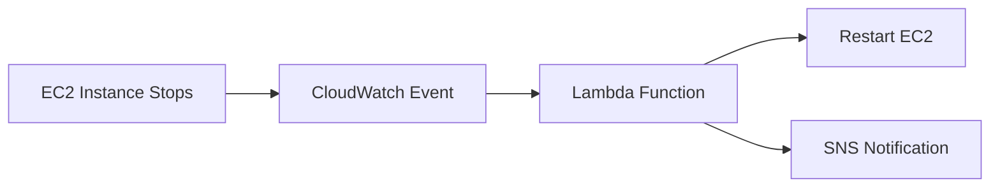

# Dineshkumar S

### Cloud & DevOps Engineer · Backend Developer

☁️ AWS &nbsp;·&nbsp; 🐳 Kubernetes &nbsp;·&nbsp; 🏗️ Terraform &nbsp;·&nbsp; 🐍 Python

 

## 👋 About

<table>
  <tr>
    <td width="50%" valign="top">

**👤 Profile**
- **Role:** Associate Software Engineer @ Stackly
- **Education:** B.E. Electronics & Communication Engineering
- **Location:** Salem, Tamil Nadu, India

   </td>
    <td width="50%" valign="top">

**🎯 Focus areas**
- Cloud infrastructure on AWS
- DevOps, CI/CD and automation
- Backend development with Python

   </td>
  </tr>
  <tr>
    <td colspan="2">

**⭐ What I bring:** hands-on **AWS and DevOps skills** (Terraform, CI/CD, Kubernetes, GitOps) together with **real application development experience** (Python, FastAPI, Django, React). I understand how software is built, and how it is shipped and kept running.

   </td>
  </tr>
</table>

---

## 🛠️ Tech Stack

 

<b>📋 Detailed skills breakdown</b>

 

| Area | Skills |
|---|---|
| **AWS** | EC2 · S3 · IAM · VPC · RDS · CloudWatch · Lambda · SNS |
| **Infrastructure as Code** | Terraform |
| **CI/CD** | Jenkins · GitHub Actions |
| **Containers & Orchestration** | Docker · Kubernetes · Helm |
| **GitOps** | Argo CD |
| **Monitoring** | Prometheus · Grafana · CloudWatch |
| **Backend** | Python · FastAPI · Django · REST APIs · JWT / RBAC · Auth0 |
| **Frontend** | React · JavaScript · HTML · CSS |
| **Database** | MySQL · SQLite · SQLAlchemy |
| **OS & Networking** | Linux (Ubuntu, CentOS) · TCP/IP · VLANs · SDN · NFV |

---

## 🚀 Featured Projects

### 🛡️ Self-Healing AWS Infrastructure
> Automatically detects stopped EC2 instances and restores them, with no manual intervention.

`Terraform` `EC2` `Lambda` `CloudWatch` `SNS`

- **Problem:** stopped instances cause downtime until someone notices.
- **Solution:** event-driven recovery provisioned entirely with Terraform.
- **Skills shown:** IaC, serverless automation, monitoring and alerting.

---

---

### 🛒 Smart E-Commerce Platform
> Full-stack store with secure auth, payments, and the complete order lifecycle.

`React` `FastAPI` `Django` `MySQL` `Auth0` `Stripe`

- JWT and role-based access control (RBAC)
- Product catalog, cart, checkout, and Stripe payments
- Refunds, returns, reviews, and ratings
- Personalized recommendations and analytics dashboard
- Django admin for operations

[🔗 View Project](https://github.com/Dineshkumarsenthil/smart-ecommerce-platform)

---

### 📝 Blog Management Platform
> Backend-focused platform covering content, engagement, and billing.

`FastAPI` `SQLAlchemy` `SQLite` `JWT` `Auth0`

- JWT authentication and Auth0 social login
- Posts, comments, and likes
- Subscriptions, billing, and invoice generation
- Email notifications and notification center
- User analytics dashboard and AI support chat

[🔗 View Project](https://github.com/Dineshkumarsenthil/blog-management)

---

## 💼 Experience

<b>🟢 Associate Software Engineer — Stackly</b> · 2026 – Present

- Full-stack development with Python, React, REST APIs, and MySQL.
- Debugging, testing, and Git-based team collaboration.
- Growing cloud and DevOps expertise alongside product development.

<b>☁️ AWS DevOps Intern — Palle Technologies, Bangalore</b> · May 2025 – Oct 2025

- Automated infrastructure provisioning with **Terraform**.
- Built **CI/CD pipelines** with Jenkins.
- Containerized applications with **Docker**.
- Applied **IAM** and AWS security practices; performed vulnerability scanning.

<b>📡 NextGen Telco & Cloud Associate — Telco Learn, Bangalore</b> · 2025

- Hands-on with Linux, networking, and cloud-native concepts.
- Explored Docker, Kubernetes, SDN, NFV, and 5G cloud-native networking.

---

## 🎓 Education & Certifications

**Bachelor of Engineering, Electronics & Communication Engineering**
SNS College of Technology, Coimbatore · CGPA **7.72 / 10**

---

## 📊 GitHub Activity

---

## 🌱 Currently Exploring

`AWS` · `Kubernetes` · `Terraform` · `CI/CD` · `Cloud Native` · `SRE` · `FastAPI`

 

*Building. Automating. Learning. Deploying.* ☁️

